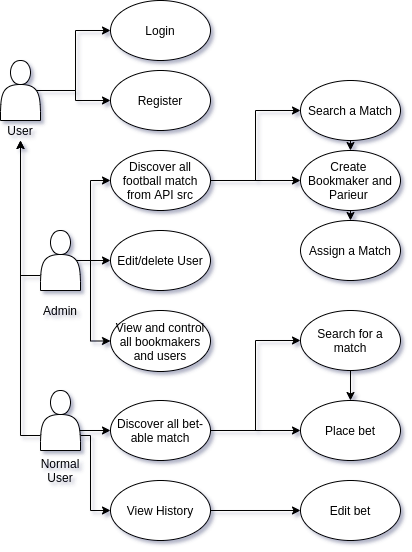
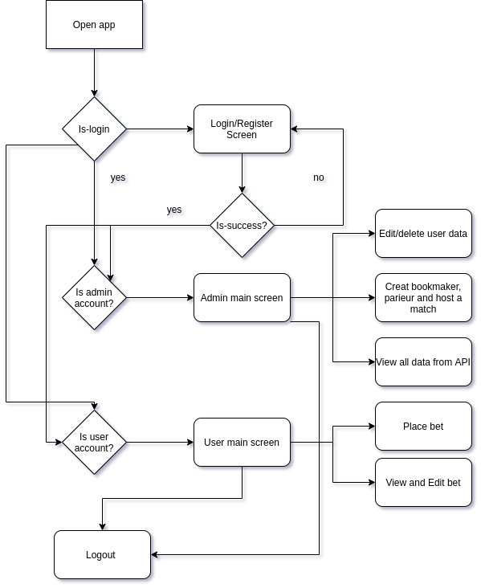
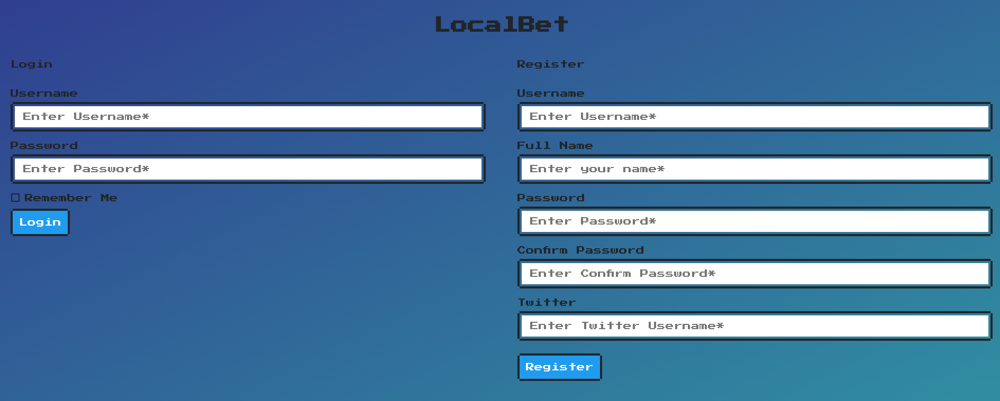
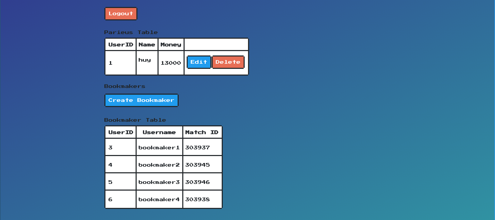
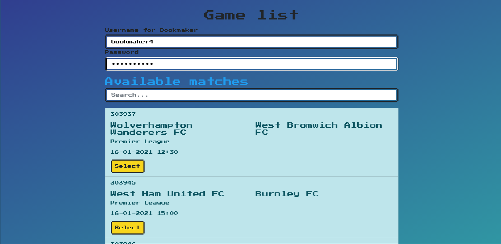
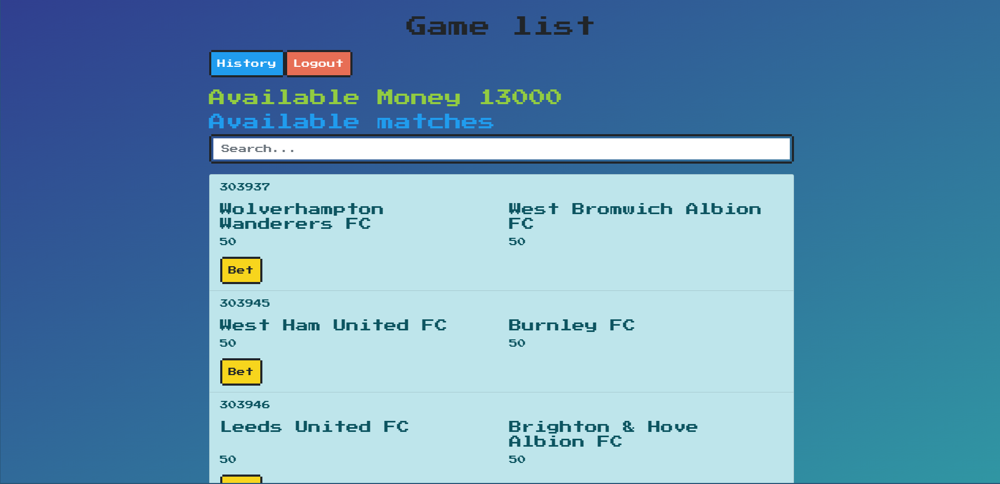
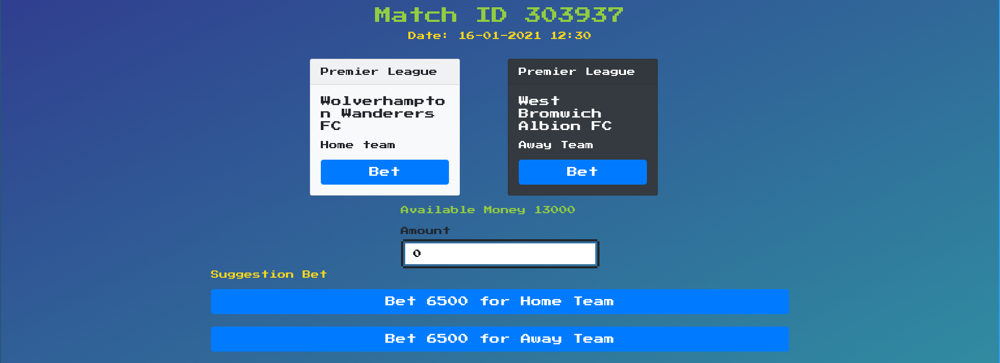
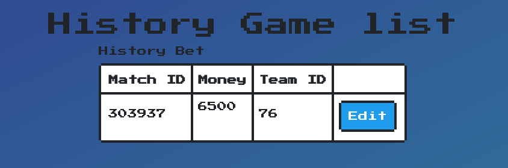

---
title: "Application de paris sportifs"
author: \textbf{DO Duy Huy Hoang} \newline
        \textbf{NGUYEN Do Duc Anh} \newline
        \textbf{NGUYEN Van Lam}
        \newline
        \newline
        \textit{University of Limoges} \newline 
date: \today
titlepage: false
header-includes: |
    \usepackage{multicol}
    \usepackage{graphicx}
footer-left: Group 13
mainfont: NewComputerModern
sansfont: NewComputerModern
monofont: Dank Mono
caption-justification: centering
...
\pagenumbering{Roman} 

\newpage{}

\listoffigures
\newpage{}
\tableofcontents
\newpage{}

\pagenumbering{arabic} 

# I. Introduction
The application that we had developed is a Football bet website with the most up-to-date matches, placing a bet on Football has never been so easy.

# II. Implemented functionalities

In this project, we have done all the required function as in the project description and also some extra features:

- Using data from [Football API](https://www.football-data.org/)
- Using MVC architecture
- Implemented REST API for Parieur
- Administrator
    - The Administrator is responsible for the creation, modification, deletion of Bettors and Bookmakers 
    - Allow Administrator to create a Bookmaker, Parieur and assign a Match for them
- Bookmaker
    - The Bookmaker is responsible for feeding the game into a match.
    - A Match is characterized by a name, a place, a list of participants
- Bettor
    - Can register an account
    - By default, everyone starts with 1000 Limcoins in their pocket.
    - The Bettor can view all proposed Matches and place Bets on all Matches that interest him in the limit of funds available
    - Changing the bet and see their history bet
    - Can search for a particular Match that interests him

# III. Programs, Materials, Architecture

In this project, we use IntellIJ with Java Platform, Enterprise Edition (Java EE) with GlassFish5 to build the web application, beside that, we also use some library for making an responsive website such as Boostrap and NES css to quickly design and customize responsive for front-end part. 

A clean codebase is always a pleasure to work with. A well organized codebase is easy to maintain, is robust, performs well, is testable and is self-documenting. In order to do that, the application will be written by using MVC - short for Model-View-Controller design pattern and also we use JSF alongside with javaEE.

## Use-cases

{ width=70% }

As the aim of this project is to create a football bet platform. The application has three main characters which is Normal User, Administrator and Bookmaker.

The administrator has the role to create a bookmaker and assign them with a real football match ( which is fetch from [Football API](https://www.football-data.org/)) and also can handle basic user data information or delete user account.

The client can browse all the available match which was hosted by administrator and a bookmaker and place a bet on it They also can edit their bet later.

The application service later will fetch the result of these match and update the user money based their bet result.

## Flow chart

{ width=70% } 

## Login and Register View

{ width=70% }

## Administrator Page

{ width=70% }

{ width=70% }

## Client Page

{ width=70% }

{ width=70% }

{ width=70% }

# IV. Conclusion and Future work

